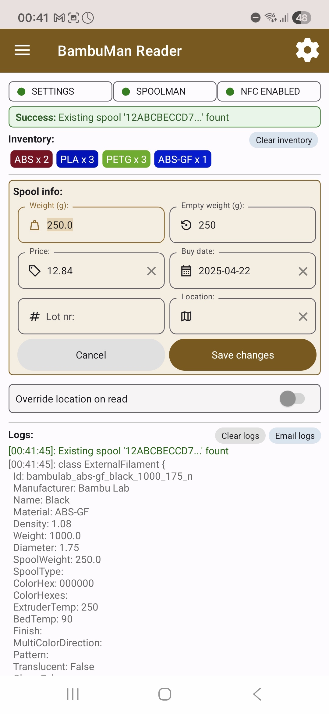
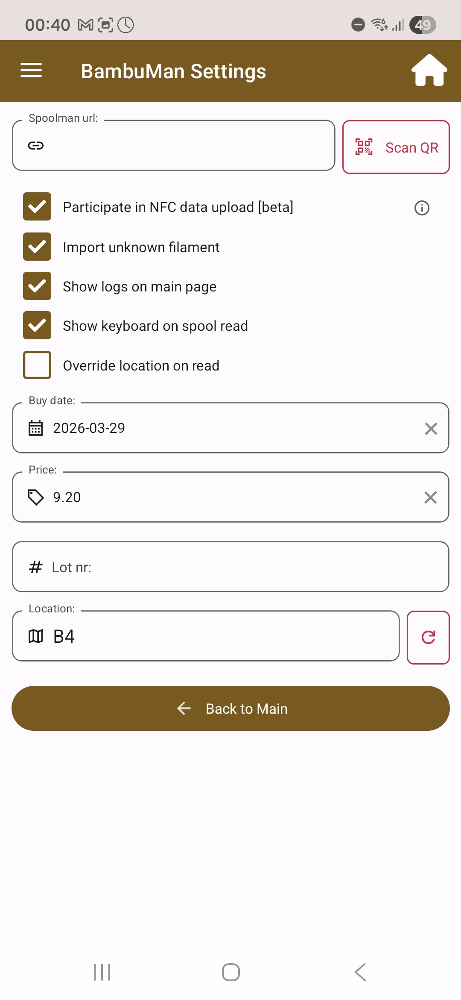
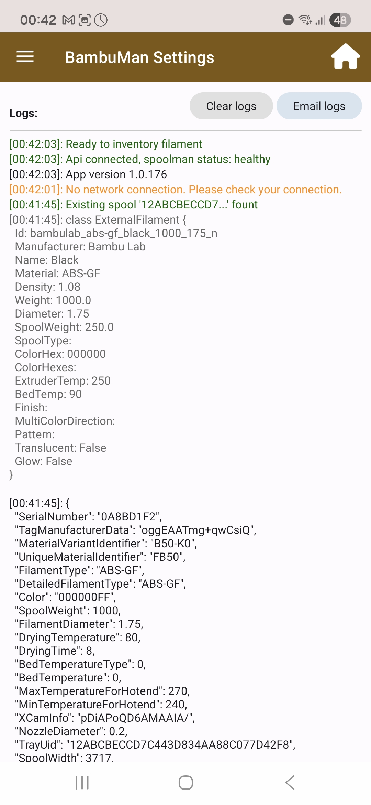
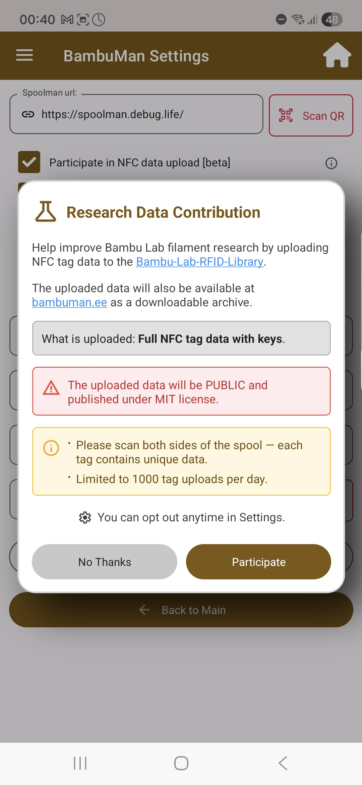
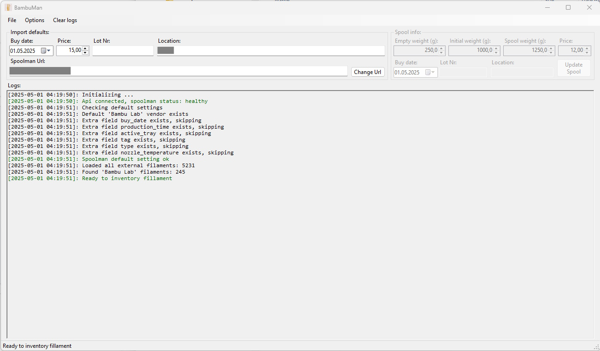

#  BambuMan

BambuMan is a companion app for [Spoolman](https://github.com/Donkie/Spoolman). It allows you to easily import spools by reading the `Bambu Lab` filaments `NFC` tag info.

The app tries to match the tag info with the existing [SpoolmanDB](https://github.com/Donkie/SpoolmanDB) entry. When a match is found, the app creates the filament and spool. Imported spools will have the same `tray_uuid` as the `AMS` reports over `MQTT`.

If you use [bambuddy](https://bambuddy.cool) ([GitHub](https://github.com/maziggy/bambuddy)) or [OpenSpoolMan](https://github.com/drndos/openspoolman) to track your filament usage, it will be able to automatically match the spool inserted into the `AMS`, no additional action is necessary.

## Download

| Google Play | F-Droid |
|:---:|:---:|
|  |  |

> **Note:** Google Play updates may arrive 1–7 days after the GitHub/F-Droid release due to Google's review process.

## Features

 - **NFC tag reading** on Android (built-in NFC) and Windows desktop (PCSC compatible reader)
 - **Automatic filament matching** with SpoolmanDB — covers most Bambu Lab filaments
 - **Inventory tracking** — groups scanned spools by material with AMS tray UID tracking
 - **Research Data Contribution** — opt-in NFC tag data upload to the [bambuman.ee](https://bambuman.ee) tag library
 - **QR code scanner** for quick Spoolman URL setup
 - **Configurable import defaults** — buy date, price, lot number, location
 - **Log viewer** with email export for troubleshooting
 - **Auto-setup** — creates required extra fields and default vendor in Spoolman

## The app is available in two versions

 - **Android** application (your phone has to support `NFC`)

   | Main | Settings | Logs | Research Data Contribution |
   |:---:|:---:|:---:|:---:|
   |  |  |  |  |

 - **Windows** desktop application (a `PCSC` compatible `NFC` reader like [ACR122U](https://www.acs.com.hk/en/products/3/acr122u-usb-nfc-reader/) or [ACR1252U](https://www.acs.com.hk/en/products/342/acr1252u-usb-nfc-reader-iii-nfc-forum-certified-reader/) is needed)

   

## How to setup

### Android
 1. Install from [Google Play](https://play.google.com/store/apps/details?id=com.noismaster.bambuman), [F-Droid](https://bambuman.github.io/repo), or download the APK manually from GitHub releases.
 2. Go to settings and scan the Spoolman URL with QR code or enter it manually.
	 - BambuMan supports basic authentication, URL format `http[s]://username:password@host[:port]/`
	 - If the password contains special characters (like `@` `:`) it must be URL encoded
 3. Go back to main window. BambuMan will connect to Spoolman and create the necessary extra fields and default vendor.
 4. Once all three status indicators `Settings`, `Spoolman` and `NFC` are green, you can start reading `NFC` tags.

### Windows

 1. You will need [.NET Desktop Runtime 10](https://dotnet.microsoft.com/download/dotnet/10.0) installed
 2. Download the released `BambuMan.exe` or compile from source
 3. Paste the Spoolman URL and click `Change Url` button
	 - BambuMan supports basic authentication, URL format `http[s]://username:password@host[:port]/`
	 - If the password contains special characters (like `@` `:`) it must be URL encoded
 4. The app connects to Spoolman and creates the necessary extra fields and default vendor.
 5. You can start reading `NFC` tags.

## F-Droid repository

If you have F-Droid installed on your phone, you can install BambuMan from our F-Droid [repository](https://bambuman.github.io/repo).

## NFC Tag Library

Contributed NFC tag data is publicly available at [bambuman.ee](https://bambuman.ee). You can browse the library or download the full archive.

To participate, enable **Research Data Contribution** in the app settings. Uploaded data is published under the MIT license.

## Known limitations

 - You can't read filaments in foil bags! The foil blocks the NFC signal. You can still inventory them when you open the bag before use.
 - Most Bambu Lab filaments are supported including 
	- PLA (Basic, Matte, Silk+, Wood, Glow, Aero, Sparkle, Tough+)
	- PETG (HF, Transparent, Translucent), 
	- ABS, ABS-GF, ASA, ASA-CF, PA6-GF, PA6-CF, PAHT-CF, TPU, PC, PVA, Support filaments, and multi-color spools. 
 - Some niche variants may still need manual matching.

## Tested with

  - [Spoolman](https://github.com/Donkie/Spoolman) v0.22.1, v0.23.0, v0.23.1
  - [bambuddy](https://bambuddy.cool) v0.1.6+ (recommended)
  - [OpenSpoolMan](https://github.com/drndos/openspoolman) v0.1.8

## Roadmap

 - Make extra fields optional
 - More intuitive UI

## Big thanks to
- [Bambu-Research-Group](https://github.com/Bambu-Research-Group) for reverse engineering the NFC tag specification
- [Plugin.NFC](https://github.com/franckbour/Plugin.NFC) for providing a plugin to use NFC in MAUI

## License

This project is licensed under the [AGPL-3.0 License](LICENSE).
